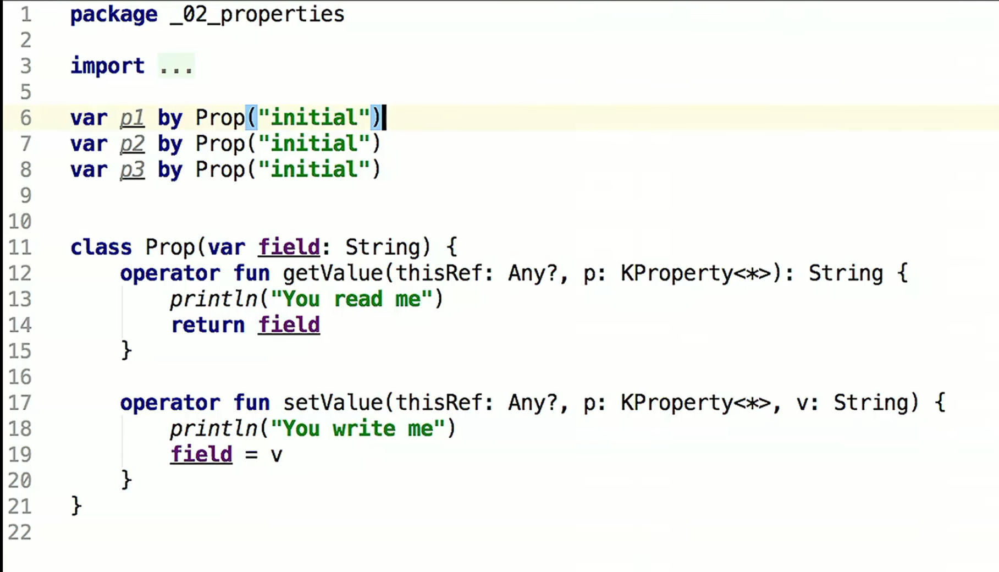
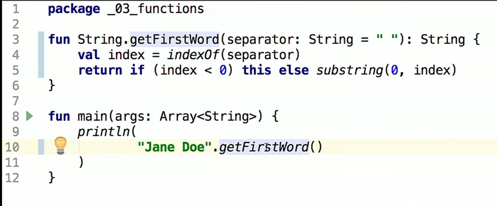
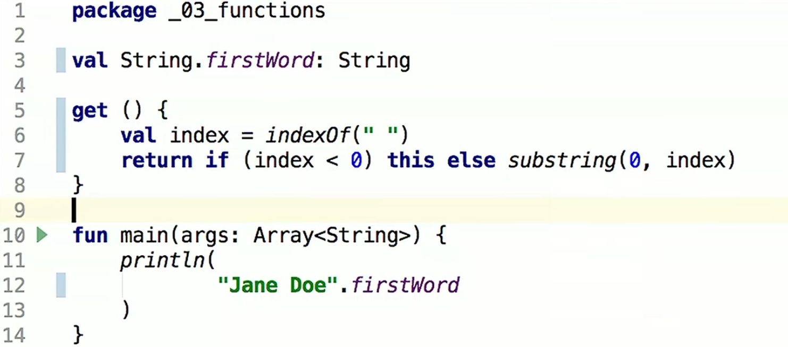

# 基本知识和语法

> 教程  https://www.youtube.com/watch?v=F9UC9DY-vIU&t=2233s 
>
> https://www.youtube.com/watch?v=6P20npkvcb8的笔记

### 基本语法、集合类

1. 关于变量
      - ```kotlin
        Var name: String="" 
        ```

      - Var 变量 val不可变 

      - 可以不加type，赋值后不能变type 

    - 值为null的变量声明时： 

      - ```kotlin
        Val name: type?=null 
        ```

2. When 语法

      ```kotlin
      when(x){
          1 -> ("x==1")
          3,4 -> print("sss")
          5...10 -> print("")
          "string" -> print("")
          else -> {
              ...
          }
      }
      ```

      

3. 函数

      ```kotlin
      fun funcName(): returnType {
      	return something
      }
      ```

      

4. "$"符号提示变量 

   ```kotlin
   var varName
   val newVar = "some $varName"
   ```

5. 数组

   ```kotlin
   var array = arrayOf("a","b","c")
   ```

6. For 循环和 forEach

   ```kotlin
   for (i in array){
   	opration(i)
   }
   ```

   ```kotlin
   array.forEach { it ->
   	operation(it)
   }
   ```

7. Map

      ```kotlin
      val map = mapOf(1 to "a")
      map.forEach{key, value -> print("$key -> $value")}
      ```

8. List

      ```kotlin
      val list = listOf("a","b")
      ```

9. Collection 有两种，一种不可变，一种mutable

10. vararg 用于参数个数可以变化的情况

      ```kotlin
      fun variableParaNum(vararg arg){}
      
      fun main(){
      	val a = listOf("a","b")
      	variableParaNum("a","b")
      	variableParaNum(*a)
      }
      ```

11. 可以指定参数(有些像Python)

       ```kotlin
       function(para1=xxx,para2=xxxxx)
       ```

12. 可以给函数指定默认的参数

       ```kotlin
       fun function(para: paraType ="aaa"){}
       ```

13. 选择赋值

       ```kotlin
       val foo:String =if(true) "aaa" else "bbb" 
       
       //看左侧的是不是null
       val foo = name ?: "no name"
       ```

14. cast type

       ```kotlin
       (varA as DataType ).fun()
       ```

15. lazy定义变量

       ```kotlin
       val os:String by lazy{
       	pirntln("")
       	System.getProperty("os.name")+"v"+...
       }
       ```

16. 自己写操作库

       

17. Extension function

       

18. Extension properties

    

19. 


 

   

   

   


### Class相关

1. ```kotlin
   class className
   ```

2. 构造器

   ```kotlin
   //空构造器
   class className constructor()
   //一种构造器
   class Person(_firstName: String,_lastName: String){
   	val firstName: String
   	val lastName: String
   	
   	init{
   		something
   	}
   }
   //另一种构造器
   class Person(_firstName: String,_lastName: String){
   	val firstName: String=_firstName
   	val lastName: String=_lastName
   }
   //还有一种
   class Person(val firstName: String, val lastName: String){}
   
   //init都会跑，在主构造器条件不满足的时候最后会跑constructor
   class Person(val firstName: String, val lastName: String){
       init{
           
       }
       
       constructor():this("Peter","Parker"){
           xxx
       }
       
       init{
           
       }
   }
   ```

3. 类变量的setter 和 getter

   ```kotlin
       var nickName: String? = null
           set(value) {
               field = value
               println("name is $value")
           }
   		get(){
              return field 
           }
   ```

4. Data class

   // TODO

### Interface

1. ```kotlin
   interface PersonInfoProvider{
   	fun printInfo()
   }
   
   interface SessionInfoprovider{
       fun getSessionId():String
   }
   
   abstract class BasicInfoProvider :PersonInfoProviderAbs
   
   class BasicInfoProvider : PersonInfoProvider,SessionInfoprovider{
       //override必须加
       override fun printInfo() {
           super.fun()
       }
   }
   
   
   ```

   

### Inheritance 

1. 